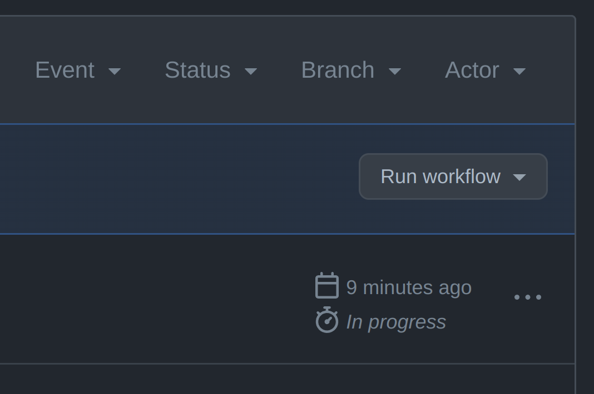

# Packages

-   [dm3-react](packages/react): dm3 UI components
-   [dm3-web](packages/web): dm3 web app
-   [dm3-backend](packages/backend): The delivery and storage service
-   [dm3-lib](packages/lib): Basic dm3 functionality

# Protocol

## Simple Summary

dm3 Protocol enables decentral, open, and secure messaging based on established web3 services like ENS and IPFS.

## Specification

https://dm3.readthedocs.io/en/doc-latest/

## Principles

-   **Decentral**: A dm3 client must be realizable as a real decentral application and the messages must also be stored in a decentral way.
-   **Open**: All parts of dm3 are open source and the protocol is permissionless. Everyone should be able to write a dm3 client.
-   **Secure**: All messages are end-to-end encrypted and the encryption keys are only under the control of the user.

## Terminology

-   **Ethereum Account Key**: The private key linked to an [Externally Owned Account](https://ethereum.org/en/whitepaper/#ethereum-accounts).
-   **Message Encryption Key Pair**: The key pair used to encrypt/decrypt messages.
-   **Signing Key Pair**: The key pair used to sign/verify messages.
-   **Storage Encryption Key**: Symmetric key to encrypt the user storage. `keccak256(personalSignWithEthAccount(salt))`
-   **Delivery Service**: The service that buffers messages until they are delivered.
-   **Registry**: A decentral service (e.g. ENS) mapping Ethereum accounts to profile registry entry URLs (e.g. using text records).
-   **Profile Registry Entry**: A resource containing properties linked to an Ethereum account that is using dm3. E.g. public keys, the delivery service URL and spam filter configuration.

## Integration Guide

This guide explains how to make a messenger dm3 compatible.

The integration test package contains executable integration examples:

-   [Basic example](packages/integration-tests/src/lib/CreateAndSend.test.ts)
-   [Example with a message proxy](packages/integration-tests/src/lib/CreateAndSendOverProxy.test.ts)

### Delivery Service Setup

The following function creates a delivery service profile and the corresponding keys. `http://a` is the URL pointing to the delivery service endpoint.

```Typescript
const {
    deliveryServiceProfile,
    keys,
} = await createDeliveryServiceProfile('http://a');
```

The delivery service profile needs to be transformed into a data URI before it can be published on-chain.

```Typescript
const profileJsonDataUri = createJsonDataUri(deliveryServiceProfileA);
```

The data URI of the profile must be published on-chain as ENS `network.dm3.deliveryService` text record on the delivery service's ENS domain.

### Creating and Publishing User Profiles

Every dm3 user needs to create and publish a profile containing:

-   the public signing key,
-   the public encryption key,
-   and a list of the ENS names referencing the delivery service the user subscribed to

The following function call will return the user profile, the keys, and the nonce.

```Typescript
const {
    signedProfile,
    keys,
    nonce,
} = await createProfile("0x...", ['a.eth'], provider);
```

The user profiles need to be transformed into a data URI before they can be published on-chain or on an off-chain resolver via CCIP.

```Typescript
const profileJsonDataUriAlice = createJsonDataUri(aliceProfile);
```

The profiles must be published on-chain or made available via CCIP.
Therefore the ENS `network.dm3.profile` text record needs to be set to the data URI containing the user profile.

### Sending and Receiving Messages

```Mermaid
flowchart LR
    s(Sender App) --> rds[Receiver Delivery Service] --> ra(Receiver App)
```

To receive messages the dm3 clients can subscribe to a "new message" event
via a WebSocket that is provided by the delivery service.
The messages could also be fetched via a REST request.

In the following example, Bob subscribes to a push service. The callback function is called by the delivery service if there is a message for Bob. The message has to be decrypted and the message signature must be checked.

```Typescript
onMessage('bob.eth', async (encryptedEnvelop: EncryptionEnvelop) => {

   // The client will decrypt a received message
   const envelop = await decryptEnvelop(
       encryptedEnvelop,
       bobKeys.encryptionKeyPair,
   );

   // The client must check the signature of a received message
   const valid = await checkMessageSignature(
       envelop.message,
       aliceProfile.profile.publicSigningKey,
       'alice.eth',
   );

   if (!valid) {
       throw Error('Signature check failed');
   }
});
```

**Note:** The communication between the receiving delivery service and receiving client app is not part of the dm3 Message Transport Protocol.

The following code example will create a message with the content 'Test Message'.

```Typescript
const messageAliceToBob = await createMessage(
    'bob.eth',
    'alice.eth',
    'Test message',
    aliceKeys.signingKeyPair.privateKey,
);
```

The message must be encrypted and put into an envelope containing the meta information needed for the delivery. The `createEnvelop` function will return an encrypted and unencrypted version of the envelope. The unencrypted version could be used for storing it with a chunk of other received and send messages in a message store. The message store could be encrypted with the generated symmetrical key.

**Note**: The storage of sent or received messages is not part of the dm3 Message Transport Protocol.

The following function returns a dm3 submit message JSON RPC Request.

```Typescript
const jsonRpcRequest = createJsonRpcCallSubmitMessage(
    encyptedEnvelopAliceToBob,
);
```

This request needs to be submitted to the URL specified in the receiver delivery service profile.

#### Message Proxy

Some messenger providers may prefer that their clients interact with a message proxy instead of directly sending messages to the receiver delivery service.

```Mermaid
flowchart LR
    s(Sender App) --> m[Message Proxy] --> rds[Receiver Delivery Service] --> ra(Receiver App)
```

In this case, the client needs to create an envelope for every delivery service in the receiver's delivery service list. These envelopes and the message are put together in the ProxyEnvelop. To create a proxy envelope `createEnvelop` needs to be replaced with `createProxyEnvelop`.

```Typescript
const proxyEnvelope = await createProxyEnvelop(
    messageAliceToBob,
    provider,
    aliceKeys,
    getRessource,
);
```

The message proxy forwards the message using the `sendOverMessageProxy` function

```Typescript
await sendOverMessageProxy({
    getRessource,
    provider,
    proxyEnvelop: envelop,
    submitMessage: async (url, envelop) => {
        httpServerPostMock(
            url,
            createJsonRpcCallSubmitMessage(envelop),
        );
    },
});
```

### Message Processing on the Delivery Service

The function`handleMessageOnDeliveryService` will decrypt the delivery information
and add a postmark (incoming timestamp) to the incoming envelope.

```Typescript
    const processedEnvelop = await handleMessageOnDeliveryService(
        encryptedEnvelop,
        dsKeysB,
        bobProfile.profile,
    );
```

After processing the envelope, the delivery service forwards the message to the receiver app.

# Deployments

## Sepolia

**ERC3668Resolver**: 0x88c8cC822095cdE6F92c8d20311C8e7dE6A98694

**SignatureVerifier**: 0xA76d65E1241CF77944AB66835Bb5389a3E53A269

# Contributing

We open feature branches from `develop` and merge them back via pull requests. The `main` branch holds the current production release.

There are 3 remote environments where the code is deployed:

1. `production` - the production environment that is automatically deployed from the `main` branch
2. `staging` - the staging environment that is automatically deployed from the `develop` branch and is used to test and review the code before it is deployed to production
3. `testing` - this environment is used to deploy feature branches people are working on and need to test in a real environment

## Using the testing environment

In order to deploy a branch to testing, do this:

1. talk to the team to make sure nobody is actively using the testing environment at the moment
2. push tje branch to the remote repository
3. open the [deploy action](https://github.com/dm3-org/dm3/actions/workflows/deploy.yml)
4. click on `Run workflow` (right side of the screen) 
5. select the branch you want to deploy
6. click on the green `Run workflow` button

Please note: if you select the `main` or `develop` branches, they will be deployed to `production` and `staging` respectively. All other branches will be deployed to `testing`.

## Pull Requests

In order to merge a feature branch into `develop`, you need to open a pull request. The pull request will be reviewed by the team and merged if it is approved. The pull request should have a meaningful title and description, and should be linked to the issue it is solving. Please also make sure that the code is properly tested and that the tests are passing. If you need help with testing, please ask the team. Ideally, link the pull request to the issue it is solving.

Once you created a pull request, letting the team know about it is a good idea. Reach out to do so.
