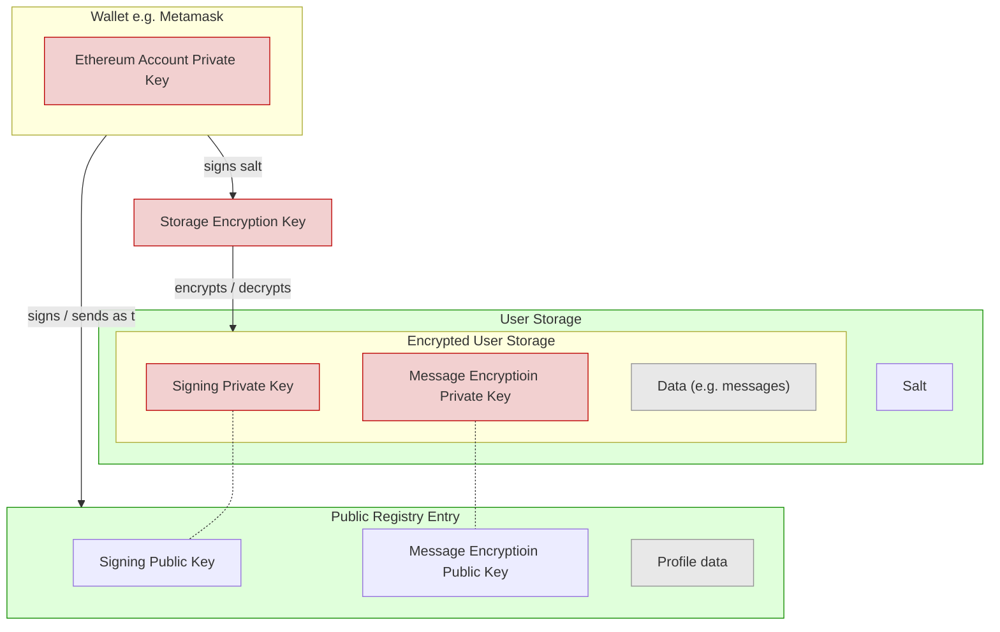
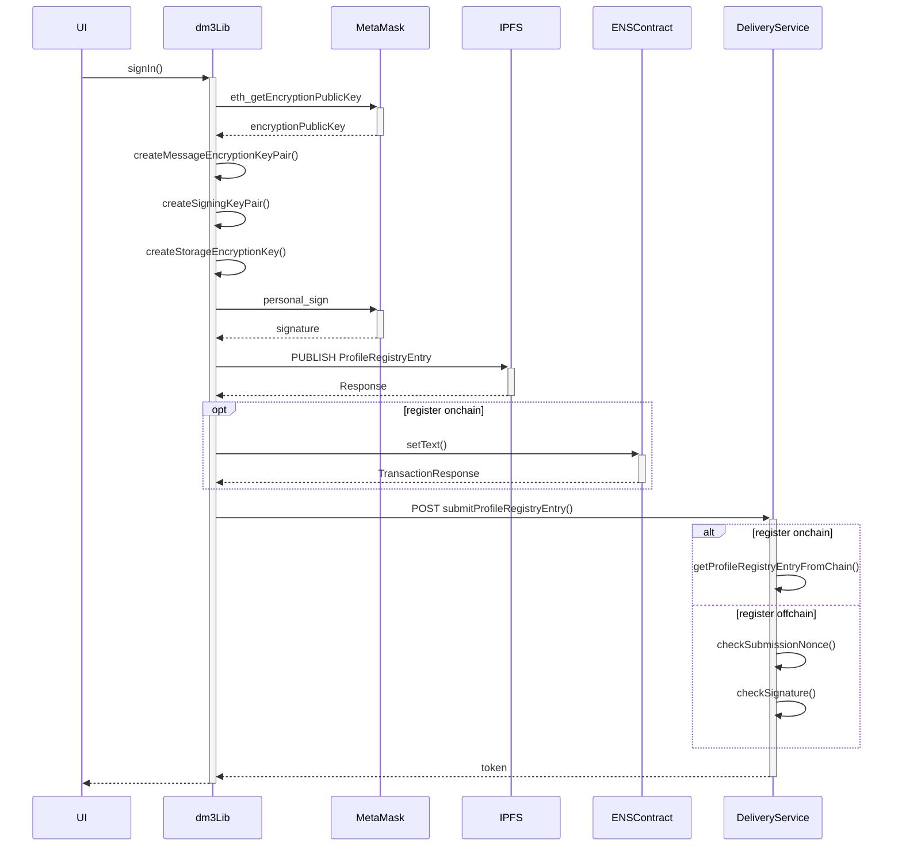
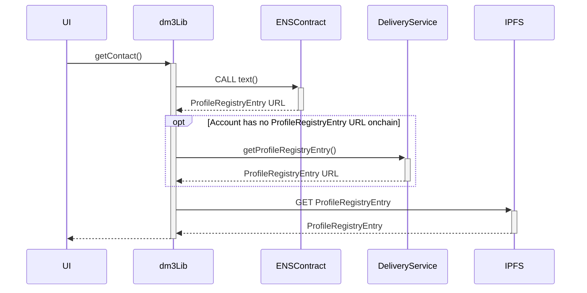
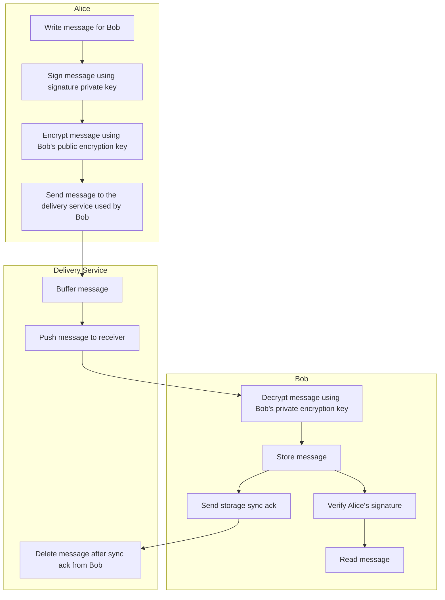
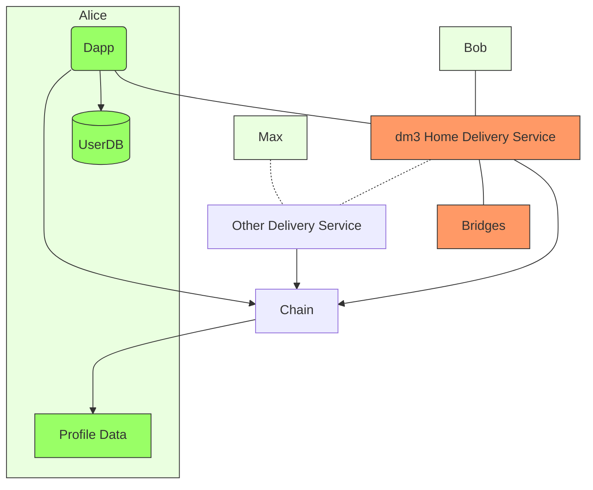

# Packages
* [dm3-react](packages/react): dm3 UI components 
* [dm3-web](packages/web): dm3 web app
* [dm3-backend](packages/backend): The delivery and storage service
* [dm3-lib](packages/lib): Basic dm3 functionality

# Protocol
## Simple Summary
dm3 Protocol enables decentral, open, and secure messaging based on established web3 services like ENS and IPFS.

## Principles 
* **Decentral**: An dm3 client must be realizable as a real decentral application and the messages must also be stored in a decentral way. 
* **Open**: All parts of dm3 are open source and the protocol is permissionless. Everyone should be able to write an dm3 client.
* **Secure**: All messages are end-to-end encrypted and the encryption keys are only under the control of the user. 

## Terminology
* **Ethereum Account Key**: The private key linked to an [Externally Owned Account](https://ethereum.org/en/whitepaper/#ethereum-accounts).
* **Message Encryption Key Pair**: The key pair used to encrypt/decrypt messages.
* **Signing Key Pair**: The key pair used to sign/verify messages.
* **Storage Encryption Key**: Synchronous key to encrypt the user storage.  `keccak256(personalSignWithEthAccount(salt))`
* **Delivery Service**: The service that buffers messages until they are delivered.
* **Registry**: A decentral service (e.g. ENS) mapping Ethereum accounts to profile registry entry URLs (e.g. using text records). 
* **Profile Registry Entry**: A resource containing properties linked to an Ethereum account that is using dm3. E.g. public keys, the delivery service URL and spam filter configuration.

## Accounts & Keys
### Keys

### Sign In 
To be compliant with the secure principle dm3 should never control an Ethereum account's private key. Therefore new key pairs need to be created to encrypt and sign messages. These key pairs need to be associated with an Ethereum account. 

There are two possibilities to associate an Ethereum account with newly created key pairs:

1. **Sign a profile registry entry containing the public keys with the Ethereum account private key.** The signature and the public keys need to be submitted to the default delivery service. 
2. **Send a transaction to an onchain registry.** This transaction should store a URL (e.g. IPFS link) onchain that points to a profile registry entry containing the public keys 

The first option is good to start with because it doesn't require paying for an onchain transaction. Nevertheless, the user should be encouraged to register the public keys onchain as soon as possible because the onchain registry serves as single point of truth and makes it easy to revoke compromised keys. It also allows the user to use another delivery service as the default one.

**Reference sequence for the first sign in:**

### Contacts
To get a profile registry entry URL for a specific account the dm3 Dapp must at first try to retrieve the profile registry entry URL from the chain. The dm3 Dapp can fallback to the delivery service registry if there hasn't been an onchain profile registry entry registered for the queried account. 

**Reference sequence for retrieving a profile registry entry:**

## Message Creation & Delivery
A message must be signed and encrypted before it can be sent. The signature is created using the private signing key of the sending account. The message is encrypted with the public message encryption key of the receiving account. The signature must be validated by the receiving side. A message is directly sent from the dm3 Dapp to the delivery service URL defined in the profile registry entry of the receiving account. 

The sending dm3 Dapp keeps the message in storage but doesn't send it if the receiving account hasn't joined dm3 yet (no onchain or offchain profile registry entry). The message is encrypted and sent as soon as the receiving account joins dm3.

## Storage
The following list gives an overview of the possible storage locations for the encrypted user storage: 
* **Local file system**: The user must always download the encrypted user storage file after using the dm3 Dapp but the user has full control over the data.  
* **IPFS using web3.storage (own account)**: The user has to provide a web3.storage token to store the encrypted user storage file on IPFS. Everyone could read the conversations if the encryption is broken and the file is still pinned.
 * **IPFS using web3.storage (dm3 account)**:  Same as above besides that the user hasn't to provide a token and that the user loses control over the pinned state of the encrypted user storage file. 
 * **Cloud (e.g. google drive)**: The user stores the encrypted user storage file using a personal account on some central proprietary cloud.

# Architecture 
