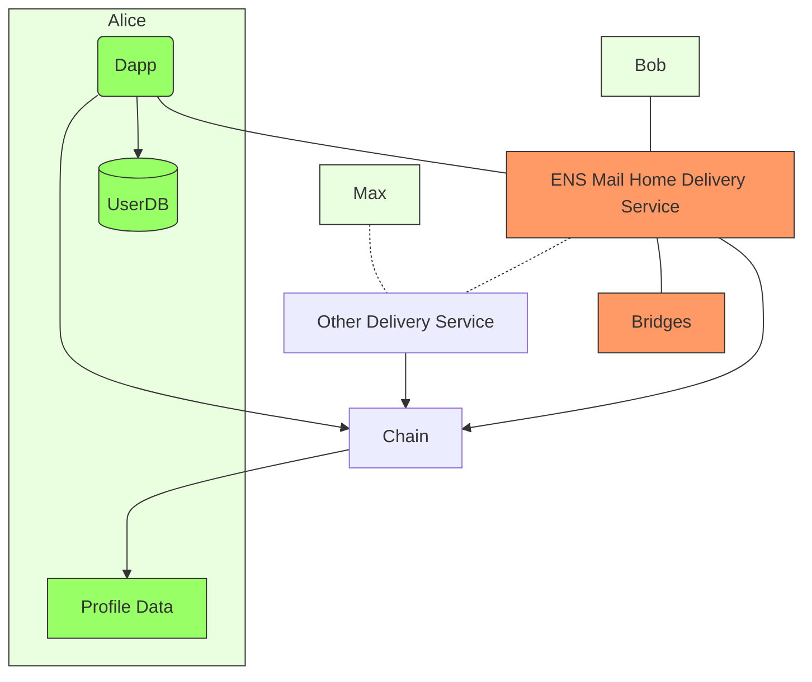
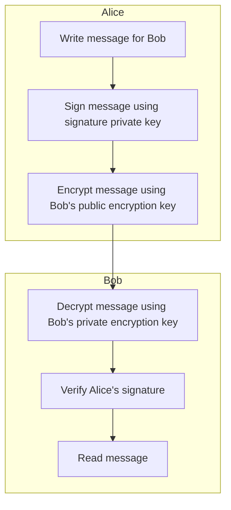

# ens-mail

## Architecture 

```mermaid
graph TD
    subgraph sg0[Alice]
        id7[(UserDB)]
        id0(Dapp)
        id10[Profile Data]
        
        
    end
    id0 --> id9[Chain]
    
    id0 --> id7
    id0 --- id1[ENS Mail Home Delivery Service] 


    id4[Bob] --- id1
    id6[Max]-.-id2
    id1 -.- id2[Other Delivery Service] 
    id1 --- id3[Bridges] 
   
   

    id1 --> id9
    id2 --> id9
    id9 ---> id10
     

   classDef green fill:#9f6,stroke:#333
   classDef lightgreen fill:#eaffe0,stroke:#333
   classDef orange fill:#f96,stroke:#333
   class id0,id7,id8,id10,sg0 green
   class id4,id6,sg0 lightgreen
   class id1,id3 orange
```
**Profile Data**
* Delivery Service URI
* Public Key(s) 

## Send Encrypted Message

```mermaid
flowchart TD
    subgraph Alice
    id1[Write message for Bob] --> id2[Sign message using signature private key]
    id2 --> id3[Encrypt message using Bob's public encryption key]
    end
    subgraph Bob
    id3 --> id5[Decrypt message using Bob's private encryption key]
    id5 --> id6[Verify Alice's signature]
    id6 --> id7[Read message]
    end
```