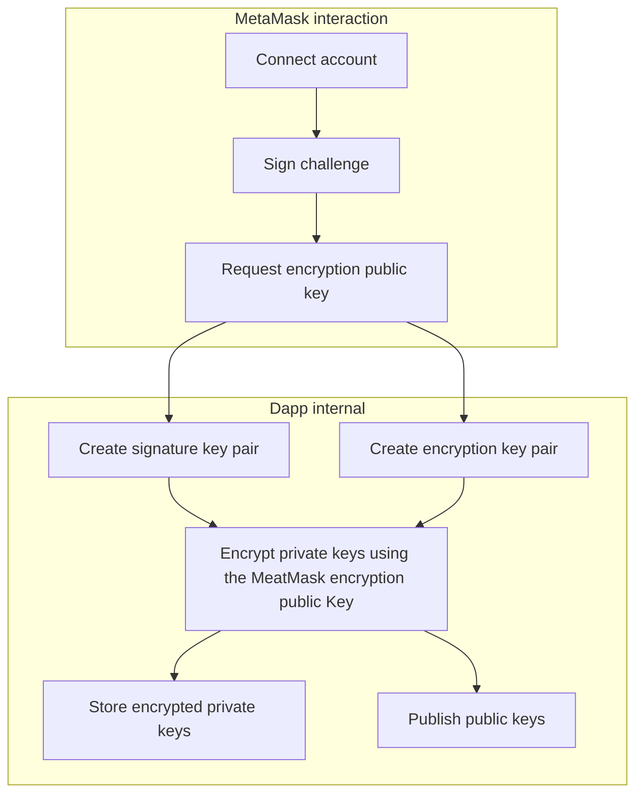
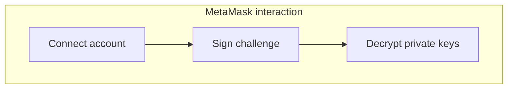
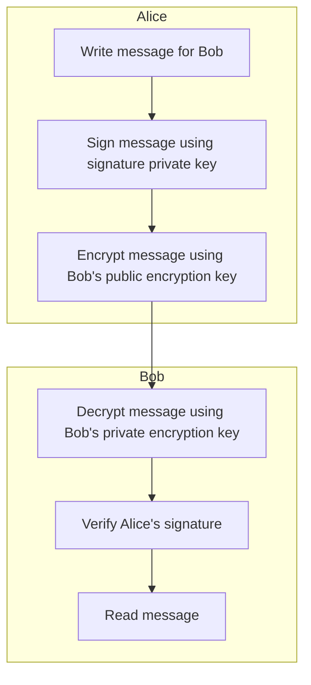

# ens-mail

## Initial Sign In

```mermaid
flowchart TD
    subgraph sg1[MetaMask interaction]
    id1[Connect account] --> id2[Sign challenge]
    id2 --> id3[Request encryption public key]
    end
    subgraph sg2[Dapp internal]
    id3 --> id4[Create signature key pair]
    id3 --> id5[Create encryption key pair]
    id4 --> id6
    id5 --> id6[Encrypt private keys using the MeatMask encryption public Key]
    id6 --> id7[Store encrypted private keys]
    id6 --> id8[Publish public keys]
    end
```

## Sign In

```mermaid
flowchart TD
    subgraph sg1[MetaMask interaction]
    id1[Connect account] --> id2[Sign challenge]
    id2 --> id3[Decrypt private keys]
    end

```

## Send Encrypted Message

```mermaid
flowchart TD
    subgraph Alice
    id1[Write message for Bob] --> id2[Sign message using signature private key]
    id2 --> id3[Encrypt message using Bob's public encryption key]
    end
    subgraph Bob
    id3 --> id5[Decrypt message using Bob's private encryption key]
    id5 --> id6[Verify Alice's signature]
    id6 --> id7[Read message]
    end
```