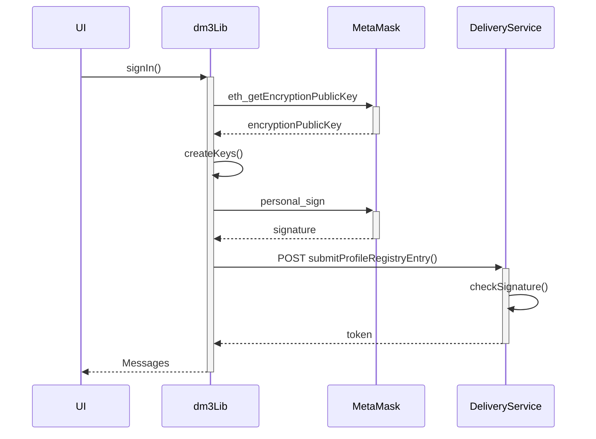
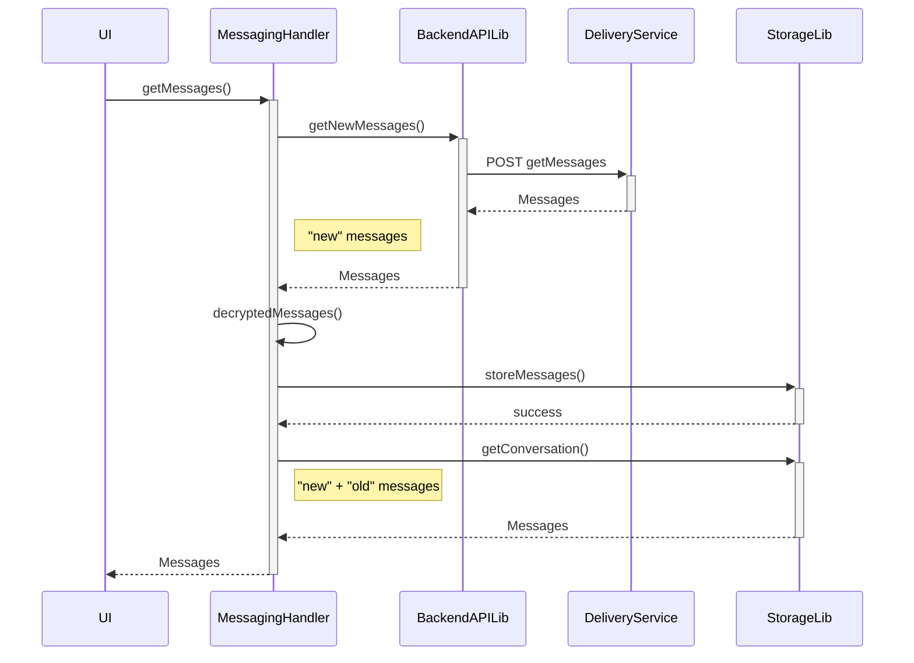

# First Sign In

```mermaid
sequenceDiagram
    UI->>+dm3Lib: signIn()
    dm3Lib->>+MetaMask: eth_getEncryptionPublicKey
    MetaMask-->>-dm3Lib: encryptionPublicKey
    dm3Lib->>dm3Lib: createKeys()
    dm3Lib->>+MetaMask: personal_sign
    MetaMask-->>-dm3Lib: signature
    dm3Lib->>+ DeliveryService: POST submitProfileRegistryEntry()
    DeliveryService->> DeliveryService: checkSignature()
    DeliveryService-->>- dm3Lib: token
    dm3Lib-->>-UI: Messages
```

# Retrieve Messages

```mermaid
sequenceDiagram
    UI->>+MessagingHandler: getMessages()
    MessagingHandler->>+BackendAPILib: getNewMessages()
    BackendAPILib->>+DeliveryService: POST getMessages
    DeliveryService-->>-BackendAPILib: Messages
    Note right of MessagingHandler: "new" messages
    BackendAPILib-->>-MessagingHandler: Messages

    MessagingHandler->>MessagingHandler: decryptedMessages()

    MessagingHandler->>+StorageLib: storeMessages()
    StorageLib-->>-MessagingHandler: success

    MessagingHandler->>+StorageLib: getConversation()
    Note right of MessagingHandler: "new" + "old" messages
    StorageLib-->>-MessagingHandler: Messages
    MessagingHandler-->>-UI: Messages
```