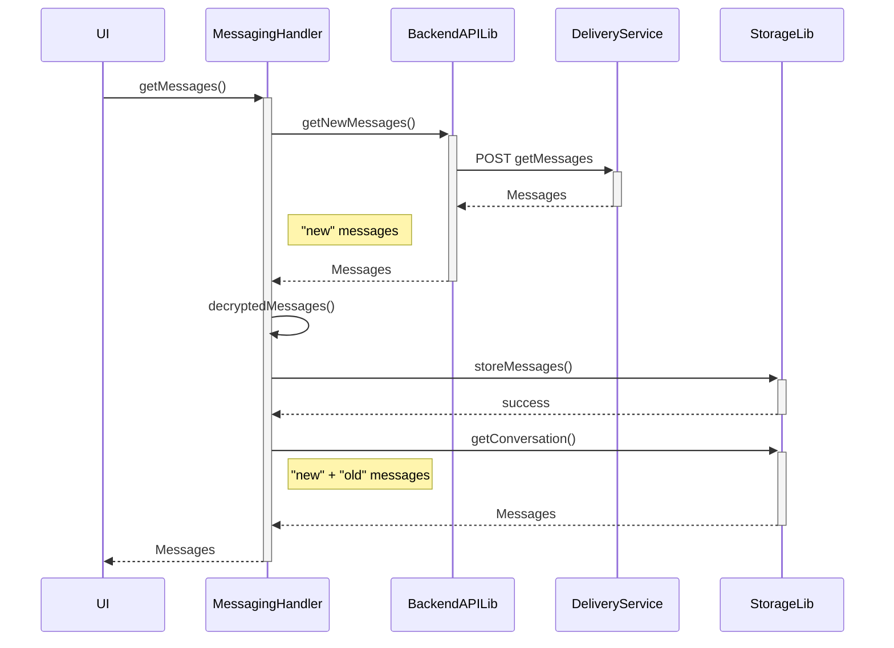

# getMessages

```mermaid
sequenceDiagram
    UI->>+MessagingHandler: getMessages()
    MessagingHandler->>+BackendAPILib: getNewMessages()
    BackendAPILib->>+DeliveryService: POST getMessages
    DeliveryService-->>-BackendAPILib: Messages
    Note right of MessagingHandler: "new" messages
    BackendAPILib-->>-MessagingHandler: Messages

    MessagingHandler->>MessagingHandler: decryptedMessages()

    MessagingHandler->>+StorageLib: storeMessages()
    StorageLib-->>-MessagingHandler: success

    MessagingHandler->>+StorageLib: getConversation()
    Note right of MessagingHandler: "new" + "old" messages
    StorageLib-->>-MessagingHandler: Messages
    MessagingHandler-->>-UI: Messages
```